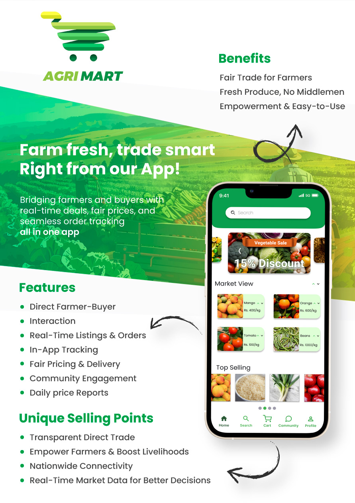

<h1 align="center" style="font-weight: bold;">Agri Mart 📱</h1>


<p align="center">AgriMart, directly connects farmers with buyers, cutting out the middlemen, ensuring farmers receive better prices, and buyers get fresh, affordable produce.</p>


<p align="center">
  </p>

<h2 id="technologies">💻 Technologies</h2>

- Flutter
- Dart
- Firebase

<h2 id="started">🚀 Getting started</h2>

Here you describe how to run your project locally

<h3>Prerequisites</h3>

Here you list all prerequisites necessary for running your project. For example:

- Flutter
- Git

<h3>Cloning</h3>

How to clone your project

```bash
git clone https://github.com/Yasindu07/Agri_Mart_UEE.git
```

<h3>Config .env variables</h2>

Use the `.env.example` as reference to create your configuration file `.env` 

```yaml
GOOGLE_API_KEY = {your google map api key}
```

<h3>Starting</h3>

How to start your project

```bash
flutter pub get
flutter run
```

<h2 id="colab">🤝 Collaborators</h2>

<p>Special thank you for all people that contributed for this project.</p>
<table>
<tr>

<td align="center">
<a href="https://github.com/inupaUdara">
<br>
<sub>
<b>Inupa Udara</b>
</sub>
</a>
</td>

<td align="center">
<a href="https://github.com/Yasindu07">
<br>
<sub>
<b>Yasindu Kalhara</b>
</sub>
</a>
</td>

<td align="center">
<a href="https://github.com/Tharindu-Sandeepa">
<br>
<sub>
<b>Tharindu Sandeepa</b>
</sub>
</a>
</td>

<td align="center">
<a href="https://github.com/Ridma-Sathsara">
<br>
<sub>
<b>Ridma Sathsara</b>
</sub>
</a>
</td>

</tr>
</table>
